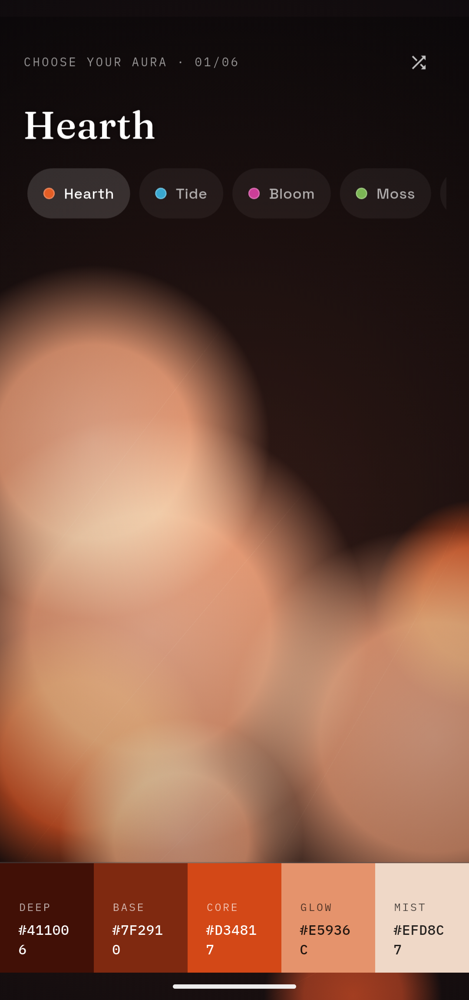
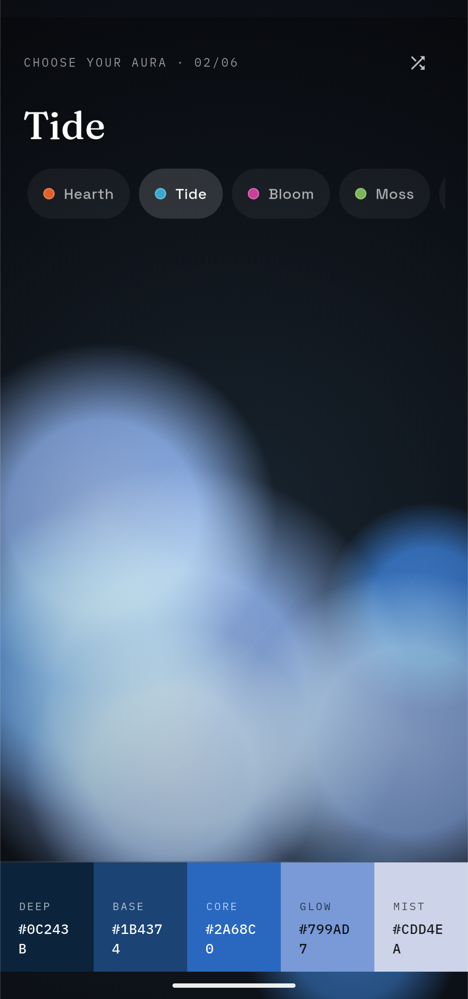
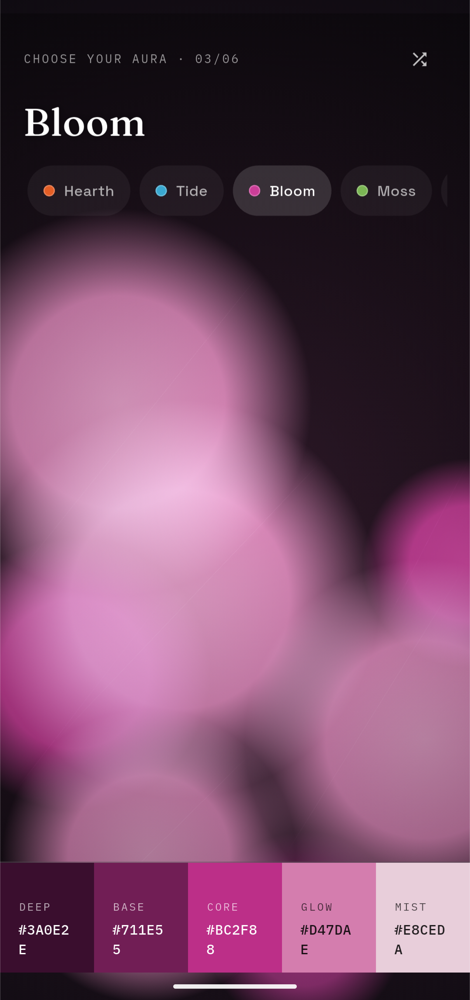
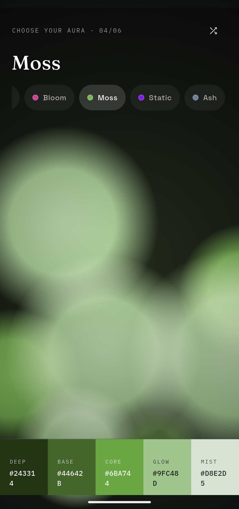
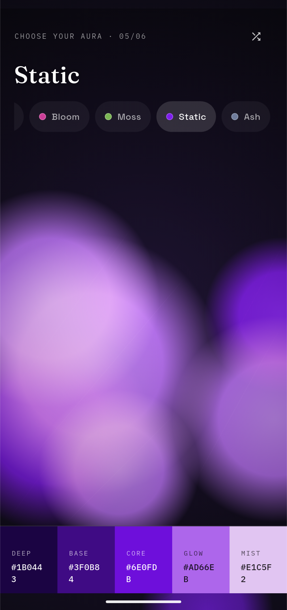
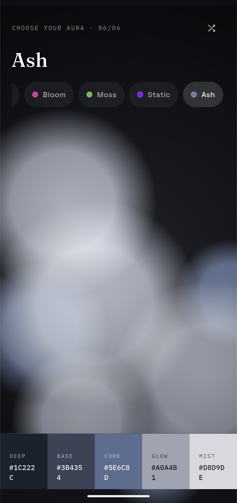

# Aura

A living palette generator. Pick a mood, and watch a five-tone color palette breathe into being behind a drifting, blurred gradient orb.

No sign-up, no backend, no nonsense. Just a small, good-looking tool for anyone who needs a color palette and would rather feel their way there than stare at a hex-code chart.

## What it does

Aura turns "what colors go with this vibe" into something you can actually watch happen.

- **Six moods, six identities.** Hearth, Tide, Bloom, Moss, Static, and Ash each carry their own hue, saturation, and personality. Pick one and the whole screen shifts to match it.
- **A living orb.** The background isn't a static gradient — it's a set of soft, blurred shapes drifting at their own pace (slow for Ash and Moss, electric and fast for Static), continuously animating behind the UI.
- **Five tones, always in the same order.** Every mood produces a Deep, Base, Core, Glow, and Mist swatch — a ready-made ramp from darkest to lightest, tuned specifically to that mood's hue.
- **Smooth mood transitions.** Switch moods and the orb doesn't jump — it cross-fades from the old palette to the new one over about a second, so the change feels like a shift in weather, not a slide switch.
- **Shuffle for variation.** Not feeling the exact tone? Shuffle nudges the current mood's hue within its own family, so you get a fresh variation without leaving the mood behind.
- **Tap to copy.** Every swatch is tappable. Tap one and its hex code is copied straight to your clipboard, confirmed with a quick toast — ready to paste into whatever you're designing.
- **Responsive by design.** Wide screens get a full sidebar with a scrollable mood list; phones get a compact header with horizontally-scrolling mood chips, so nothing feels squeezed no matter the screen size.

## How to use it

1. **Pick a mood** from the sidebar (wide screens) or the chip row (phones). The orb and palette update immediately.
2. **Watch it settle.** The colors interpolate smoothly into place — give it a second before judging the vibe.
3. **Shuffle** if you want a variation on the same mood without picking a new one entirely.
4. **Tap any swatch** in the palette ribbon at the bottom to copy its hex code.
5. **Paste it** wherever you're actually working — a design tool, a stylesheet, a mood board, anywhere hex codes are welcome.

That's the whole app. It does one thing, and it tries to do it with a bit of atmosphere.

## Running it locally

```bash
flutter pub get
flutter run
```

Requires Flutter with the `google_fonts` package (already listed in `pubspec.yaml`) for the Fraunces / Space Grotesk / IBM Plex Mono type pairing.

## Screenshots

All six auras, one after another.

<p align="center">
  <strong>Hearth</strong><br/>
  <br/><br/>
  <strong>Tide</strong><br/>
  <br/><br/>
  <strong>Bloom</strong><br/>
  <br/><br/>
  <strong>Moss</strong><br/>
  <br/><br/>
  <strong>Static</strong><br/>
  <br/><br/>
  <strong>Ash</strong><br/>
  
</p>

## Built with

Flutter, `CustomPainter`, and an unreasonable amount of care about how a gradient should drift.
